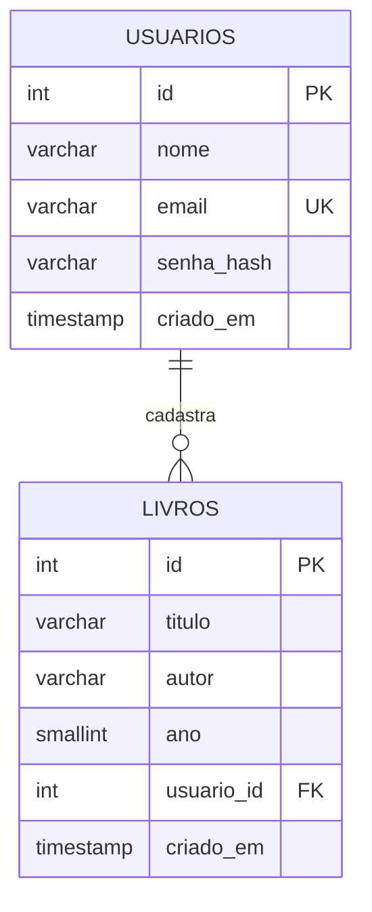

# Modelo do banco de dados

Banco: MySQL 8 | Nome: `biblioteca`



## Tabelas

### usuarios
| Coluna | Tipo | Regra |
|---|---|---|
| id | INT | chave primária, auto incremento |
| nome | VARCHAR(100) | obrigatório |
| email | VARCHAR(150) | obrigatório, único |
| senha_hash | VARCHAR(255) | obrigatório (hash bcrypt, nunca a senha) |
| criado_em | TIMESTAMP | preenchido automaticamente |

### livros
| Coluna | Tipo | Regra |
|---|---|---|
| id | INT | chave primária, auto incremento |
| titulo | VARCHAR(200) | obrigatório |
| autor | VARCHAR(150) | obrigatório |
| ano | SMALLINT | opcional |
| usuario_id | INT | obrigatório, chave estrangeira para usuarios(id) |
| criado_em | TIMESTAMP | preenchido automaticamente |

## Relacionamento

Um usuário pode cadastrar vários livros (1:N). Ao excluir um usuário, seus livros são excluídos (`ON DELETE CASCADE`).

## Dados de exemplo

O `db.sql` cria o usuário `exemplo@email.com` (senha `Senha123`, apenas para testes) e 5 livros.

## Como criar o banco

```bash
mysql -u root -p < db.sql
```
